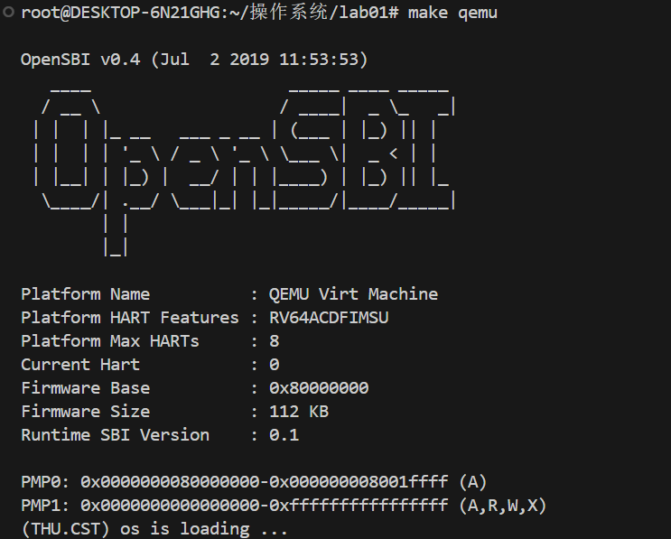
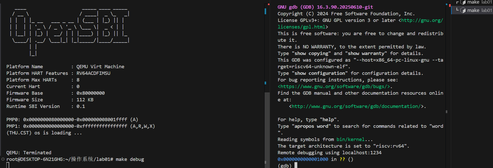
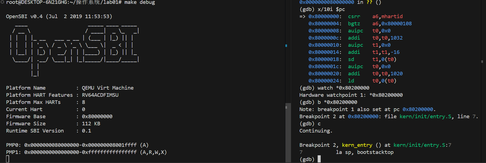

<center>
    <h1>OS-lab01实验报告</h1>
</center>


### 请大家务必在10.8日前完成各自Part，方便统一文风的同学整理报告


### 任务一（冯part）

#### 1. 操作系统内核启动流程

​     首先，最小可执行内核的**完整启动流程**为: 

```txt
加电复位 → CPU从0x1000进入MROM → 跳转到0x80000000(OpenSBI) → OpenSBI初始化并加载内核到0x80200000 → 跳转到entry.S → 调用kern_init() → 输出信息 → 结束
```

​     一个最小化的 RISC-V 操作系统内核从加电到执行其第一条指令，其启动流程可以清晰地划分为三个核心阶段，涉及硬件、固件和内核的紧密协作。

1.  **硬件初始化与固件加载**：

   操作系统内核启动开始于硬件的加电复位。此时，CPU 的程序计数器（PC）被硬件强制设置为一个预定义的复位地址 `0x1000`，该地址指向一段存储在只读存储器中的初始引导代码（MROM）。这段代码功能极为简单，仅完成最基础的硬件配置，其核心任务是将控制权移交至功能更完善的引导固件——OpenSBI。OpenSBI 被加载到物理内存的 `0x80000000` 地址处，CPU 随即跳转至该地址继续执行。

2.  **运行环境准备与内核加载**

   接下来，OpenSBI 开始主导启动过程。作为运行在 RISC-V 最高特权级（M模式）下的底层固件，它负责对处理器进行全面的运行时初始化，为操作系统的运行准备一个稳定、可靠的硬件环境。完成初始化后，OpenSBI 会从存储设备中读取操作系统内核的镜像文件，并将其精确地加载到物理内存的 `0x80200000` 地址（内核约定的入口点）。

3. **内核接管与控制权移交**

   这是启动流程的最后一个环节，也是内核开始真正运行的时刻。OpenSBI 在完成其所有任务后，执行一条跳转指令，将处理器的执行流交给位于 `0x80200000` 的内核入口代码。

   首先执行的就是该部分任务所提到的由汇编语言编写的入口程序 `entry.S`。它的任务简洁而关键：

   - **设置内核堆栈**：初始化堆栈指针，为后续使用C语言编写的高级功能（如函数调用、局部变量）搭建必需的运行环境。

   - **跳转到主函数**：随后，它立即跳转到由C语言实现的内核主初始化函数 `kern_init()`。

​    执行完这些后，系统的控制权从引导固件完全移交给了操作系统内核。`kern_init` 函数将开始执行一系列复杂的初始化工作，例如输出启动信息、初始化内存管理和进程管理等，最终将系统带入一个完整可用的状态。

#### 2. entry.S代码解析

​     在上面对启动流程的分析中我们提到过，`0x80200000`是内核代码在内存中的地址，而`entry.S`是操作系统内核被 OpenSBI 加载后，**CPU 执行的第一段内核代码**。它的核心任务是**搭建一个最简单的 C 语言运行环境**，然后跳转到 C 语言写的主初始化函数 `kern_init`。，下面我们对`entry.S`进行详细分析：

- **头文件引入**

  ```assembly
  #include <mmu.h>
  #include <memlayout.h>
  ```

  这两行就类似于C语言中的`#include`，其中`<mmu.h>`通常包含与**内存管理单元**相关的常量定义，如页大小；`<memlayout.h>`：定义了内核的**内存布局**，如内核代码、数据、堆栈的起始地址和大小。`KSTACKSIZE` 和 `PGSHIFT` 很可能就在这些头文件中定义。

- **代码段定义**

  ```assembly
      .section .text,"ax",%progbits
  ```

  这行代码则是用于声明接下来的代码属于 **`.text` 段**，告诉链接器将后续的指令放入程序的可执行代码段。

  - `"ax"`：`a` 表示**可分配**，`x` 表示**可执行**。
  - `%progbits`：表示该段包含程序数据。

- **全局入口点**

  ```assembly
      .globl kern_entry
  kern_entry:
  ```

  `.globl kern_entry`是将 `kern_entry` 声明为**全局符号**，这样链接器就知道这是一个可以从外部（如OpenSBI）访问的入口点；而下面的`kern_entry:`代表一个**标签**，定义了内核入口点的地址。OpenSBI 完成加载后，就会跳转到这个地址开始执行内核。

- **设置堆栈指针**

  ```assembly
      la sp, bootstacktop
  ```

  首先`la`是`load address`的伪指令，会被汇编器展开为实际的 `auipc` 和 `addi` 指令；`sp`则是RISC-V 中的堆栈指针寄存器；`bootstacktop`是内核堆栈的**栈顶地址**（在代码后面定义）。

  这行代码实现的功能是**初始化堆栈指针**，这是跳转到C语言代码执行前的**必备步骤**，因为C语言的函数调用、局部变量等都依赖于堆栈。

- **跳转到C主函数**

  ```assembly
      tail kern_init
  ```

  `tail`也是一个伪指令，用于尾调用，它执行的操作是跳转，并提示编译器/硬件这**不是一个需要返回的函数调用**，所跳转到的`kern_init`就是C语言编写的主初始化函数。

  这样就完成了**将控制权从汇编彻底移交给C**这一步，从此，操作系统的主要逻辑将由C代码完成。

- **内核堆栈的分配**

  ```assembly
  .section .data
      # .align 2^12
      .align PGSHIFT
      .global bootstack
  bootstack:
      .space KSTACKSIZE
      .global bootstacktop
  bootstacktop:
  ```

  - [ ] **`.section .data`**表示切换到**.data段**（数据段），堆栈空间属于初始化数据。
  - [ ] **`.align PGSHIFT`**：`PGSHIFT` 在 `mmu.h` 中定义，确保 `bootstack` 的起始地址是**页对齐**的，这对于后续启用MMU和虚拟内存管理至关重要。
  - [ ] **`.global bootstack`** 和 **`.global bootstacktop`**：将这两个符号声明为全局，以便在其它文件（如这个entry.S）中引用。
  - [ ] **`bootstack:`**：内核堆栈的**起始地址**标签。
  - [ ] **`.space KSTACKSIZE`**：分配一段连续的 `KSTACKSIZE` 大小的内存空间（例如 32KB）作为内核启动堆栈。
  - [ ] **`bootstacktop:`**：内核堆栈的**栈顶地址**标签。

  堆栈从高地址向低地址生长，`bootstacktop` 是堆栈的最高地址，而 `bootstack` 是堆栈的最低地址。初始化时，`sp` 被设置为 `bootstacktop`，指向这片空间的最高处。

#### 3. 关键指令的操作与目的

   详细的指令操作我们已经在上一部分说过了，所以我们现在只是简单地对练习题所要求的内容做一个总述：

1.    **`la sp,bootstacktop`**
   - **操作：**该指令用于将堆栈指针设置为 `bootstacktop` 的地址。
   - **目的：**为C语言代码执行做好准备，C 语言函数调用、局部变量都依赖于堆栈，所以在跳转到 C 代码之前，必须有一个有效的堆栈空间。
2. **`tail kern_init`**
   - **操作：**跳转到 C 函数 `kern_init` 的地址。
   - **目的：**将执行流程从汇编代码移交到 C 代码，启动内核初始化（`kern_init` 是内核的主初始化函数，负责后续所有初始化工作）。

### 任务二(刘part)

首先我们先测试`make qemu`语句,运行得到如下结果

说明我们环境配置无误，可以开始我们的调试工作

依据实验指导书的内容，我们开启两个终端，一个执行make debug,另一个执行make gdb.


随后我们开始跟踪QEMU模拟的RISC-V从加电开始，直到执行内核第一条指令的整个过程。在上图中我们可以看到'0x0000000000001000 in ?? ()'说明程序此时暂停在`0x1000`处。这是CPU的复位向量地址，处理器将从此处开始执行复位代码。

接下来我们使用指令`x/10i $pc`显示即将执行的10条指令，得到

```
(gdb) x/10i $pc
=> 0x1000:      auipc   t0,0x0     #t0 = pc + 0=0x1000
   0x1004:      addi    a1,t0,32   #a1 = t0 + 32 = 0x1020
   0x1008:      csrr    a0,mhartid #a0 = mhartid = 0
   0x100c:      ld      t0,24(t0)  #t0 = [t0 + 24]
   0x1010:      jr      t0         #跳转到t0的位置
   0x1014:      unimp
   0x1016:      unimp
   0x1018:      unimp
   0x101a:      .insn   2, 0x8000
   0x101c:      unimp
```
我们使用指令`x/1xw 0x1018`,查看地址`0x1018`中的数据,得到`0x1018: 0x80000000`,可以知道在指令`0x1010`后，CPU跳转到地址`0x80000000`.而我们知道，QEMU在开始执行任何指令之前，首先要将bootloader的OpenSBI.bin加载到物理内存地址0x80000000开头的区域上，因此在跳转指令执行后，CPU将开始执行OpenSBI.bin程序.

跳转执行完毕后显示`0x0000000080000000 in ?? ()`,此时我们再执行指令`x/10i $pc`,得到
```
0x80000000:  csrr    a6,mhartid
   0x80000004:  bgtz    a6,0x80000108
   0x80000008:  auipc   t0,0x0
   0x8000000c:  addi    t0,t0,1032
   0x80000010:  auipc   t1,0x0
   0x80000014:  addi    t1,t1,-16
   0x80000018:  sd      t1,0(t0)
   0x8000001c:  auipc   t0,0x0
   0x80000020:  addi    t0,t0,1020
   0x80000024:  ld      t0,0(t0)
```
该处的指令主要是为了加载操作系统内核并启动操作系统的执行.

接下来我们在`0x80200000`处通过指令`b *0x80200000`设置断点.然后输入c，执行到断点处。

可以看到此时内核已经启动

输入指令`x/10i $pc`，得到
```
 0x80200000 <kern_entry>:     auipc   sp,0x3
   0x80200004 <kern_entry+4>:   mv      sp,sp
   0x80200008 <kern_entry+8>:
    j   0x8020000a <kern_init>
   0x8020000a <kern_init>:      auipc   a0,0x3
   0x8020000e <kern_init+4>:    addi    a0,a0,-2
   0x80200012 <kern_init+8>:    auipc   a2,0x3
   0x80200016 <kern_init+12>:   addi    a2,a2,-10
   0x8020001a <kern_init+16>:   addi    sp,sp,-16
   0x8020001c <kern_init+18>:   li      a1,0
   0x8020001e <kern_init+20>:   sub     a2,a2,a0
```
发现与内核中的`kernel_entry`代码块的内容一致，说明`0x80200000`的确是内核的起始位置。

<div style="background-color:#f9f9f9; padding:8px; border-radius:6px;">
<b>问题一:</b> RISC-V 硬件加电后最初执行的几条指令位于什么地址？
</div>
RISC-V硬件加电后，将要执行的指令在复位地址`0x1000`到跳转指令`0x1010`处。
<b>问题二:</b> 它们主要完成了哪些功能？
</div>
具体的指令如下:
```
   0x1000:      auipc   t0,0x0     #t0 = pc + 0=0x1000
   0x1004:      addi    a1,t0,32   #a1 = t0 + 32 = 0x1020
   0x1008:      csrr    a0,mhartid #a0 = mhartid = 0
   0x100c:      ld      t0,24(t0)  #t0 = [t0 + 24]
   0x1010:      jr      t0         #跳转到t0的位置
```
具体而言
- `auipc   t0,0x0`将`t0`寄存器的值设置为0x1000
- `addi    a1,t0,32` `a1`寄存器的值设置为0x1020
- `csrr    a0,mhartid` 将`a0`寄存器设置为当前CPU核心ID
- `ld      t0,24(t0)` 从`t0+24`位置加载内存地址
- `jr      t0`跳转到`t0`地址，将控制权转移给下一个启动阶段(OpenSBI.bin)


### extra(袁Part)