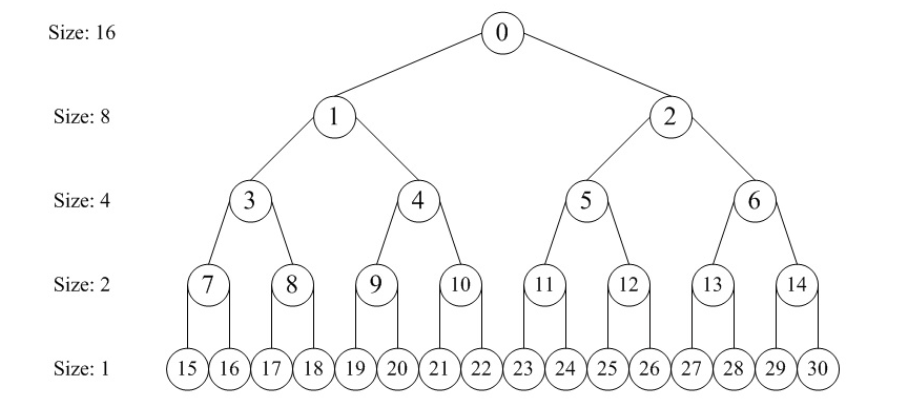

<center>
<h1>OS-lab02实验报告</h1>
</center>

### 实验要求

1.理解first-fit 连续物理内存分配算法

阅读实验手册的教程并结合`kern/mm/default_pmm.c`中的相关代码，认真分析default_init_memmap，default_init，default_alloc_pages， default_free_pages等相关函数，并描述程序在进行物理内存分配的过程以及各个函数的作用。

回答：你的first fit算法是否有进一步的改进空间？

2.实现 Best-Fit 连续物理内存分配算法（需要编程）

参考kern/mm/default_pmm.c对First Fit算法的实现，**编程实现Best Fit页面分配算法**，算法的时空复杂度不做要求，能通过测试即可。 

回答：你的 Best-Fit 算法是否有进一步的改进空间？

3.扩展练习Challenge：buddy system（伙伴系统）分配算法（需要编程）

在ucore中**实现buddy system分配算法**，要求有比较充分的测试用例说明实现的正确性，需要有设计文档。

4.扩展练习Challenge：任意大小的内存单元slub分配算法（需要编程）

在ucore中**实现slub分配算法**。要求有比较充分的测试用例说明实现的正确性，需要有设计文档。

5.扩展练习Challenge：硬件的可用物理内存范围的获取方法（思考题）

如果 OS 无法提前知道当前硬件的可用物理内存范围，请问你有何办法让 OS 获取可用物理内存范围？

#### 实验内容(part 1 + part2)

练习一：

- 函数`default_init_memmap`主要用于初始化一段连续的内存区域，将其转化为一个空闲的内存块。

具体而言，该函数是first_fit算法的初始化阶段，为内存分配器建立了一个有序的空闲内存块链表。给定输入空闲块的起始页面指针Base以及空闲内存块的页面数量n，则该函数会将以Base开始的连续n个Page进行清空初始化，然后被串入空闲内存块链表free_list(双向循环链表，链表中的空闲块依据其起始位置地址大小从小到大排序)。

串入链表的逻辑如下:
```
if (list_empty(&free_list)) {
        list_add(&free_list, &(base->page_link));
    } else {
        list_entry_t* le = &free_list;
        while ((le = list_next(le)) != &free_list) {
            struct Page* page = le2page(le, page_link);
            if (base < page) {
                list_add_before(le, &(base->page_link));
                break;
            } else if (list_next(le) == &free_list) {
                list_add(le, &(base->page_link));
            }
        }
    }
```
若此时`free_list`是一个空链表，那么则直接加入新块，即将表头直接与该页面的`Page_link`连接，通过函数`list_add`实现。

若此时并非空链表，那么就开始逐个遍历链表元素，将其插入到链表中起始位置刚好大于插入空闲块的起始位置(Base)地址的元素之前，通过`list_add_before`实现。若链表中所有元素的页面地址都小于Base，那么就插入链表末尾。

其中空闲块传入链表的地址为Page的一个成员值，要从成员值获取Page的Base，需要通过`le2page`宏实现。它的作用是，给定 `list_entry* le`，以及 `member = page_link`，利用 `to_struct` 宏，从 `le` 的地址向前偏移，得到 `Page` 结构体的首地址，最终返回 `Page*`。

- `default_init`函数则是对用于串接所有空闲块的双向循环链表`free_list`的初始化函数。

具体而言，该函数会获取空闲链表头节点的地址，并将链表头节点的`prev`,`next`指针都指向自身，形成空链表。并通过`nr_free = 0`标识没有任何空闲页面。

- `default_free_pages`函数则实现了`first_fit`算法的内存释放逻辑，给定要释放内存的起始页面指针`Base`以及要释放的页面数量，即可释放对应的连续内存块。

首先是将对应的内存块进行清空和初始化，然后与函数`default_init_memmap`逻辑一致，将清空和初始化后的空闲内存块串入空闲量表`free_list`.最后进行后向合并，若释放的内存与已经在空闲链表中的后一个空闲块在地址上是连续的`base + base->property == p`,那么我们可以将这两个空闲块进行合并。

- `default_alloc_pages`函数则是进行内存分配的函数，对应的算法是`first_fit`算法，给定需要分配的连续页面数量，则返回分配到的内存块第一个页面的指针(若成功)

具体而言，先遍历空闲链表`free_list`,若存在满足条件`p->property >= n`，即空闲块连续页面数量大于等于n的空闲块，则将第一个满足该条件的内存块(`page`)取出。然后在空闲链表中删除对应的内存块。若该空闲块的大小大于n，那么就需要进行内存块分裂，将`page + n`作为新的内存块的起始地址，其中剩余的块数为`pape->property - n`，插入到原来的位置。

采用的`first_fit`算法存在大量的优化空间，下面是一些在不改变其核心实现算法的优化:

- 我们可以维护多个`free_list`,以空闲块的大小分类，减少检索空间

- 我们可以增加跳表或其他数据结构，实现复杂度更低的查找

- 可以加入缓存机制

练习二:

要求实现`Best_fit`的内存分配算法，简单来说在`first_fit`中我们的策略是找到空闲链表`free_list`中第一个足够大的空闲块，但是这种方法一方面会产生大量的内存碎片，出现总内存足够但无法继续分配的问题，内存利用效率地下；另一方面`first_fit`往往倾向于选择较低地址的内存块，高地址的内存被忽略。

`Best_fit`为了解决这一问题，在分配内存时我们不选择第一个足够大的空闲块，而是选择最接近的满足要求的内存块。

具体来说，我们对`first_fit`的代码进行更改
```
while ((le = list_next(le)) != &free_list) {
        struct Page *p = le2page(le, page_link);
        if (p->property >= n) {
            // page = p;
            if (p->property < min_size) {
                min_size = p->property;
                page = p;
            }
        }
    }
```

为了测试我们更改的正确性，我们将`pmm.c`中的`pmm_manager`更改为`best_fit_pmm_manager`然后进行执行`make grade`进行测试。

得到如下结果:
```
root@DESKTOP-6N21GHG:~/操作系统/lab02# make grade
>>>>>>>>>> here_make>>>>>>>>>>>
gmake[1]: Entering directory '/root/操作系统/lab02' + cc kern/init/entry.S + cc kern/init/init.c + cc kern/libs/stdio.c + cc kern/debug/panic.c + cc kern/driver/console.c + cc kern/driver/dtb.c + cc kern/mm/best_fit_pmm.c + cc kern/mm/default_pmm.c + cc kern/mm/pmm.c + cc libs/printfmt.c + cc libs/readline.c + cc libs/sbi.c + cc libs/string.c + ld bin/kernel riscv64-unknown-elf-objcopy bin/kernel --strip-all -O binary bin/ucore.img gmake[1]: Leaving directory '/root/操作系统/lab02'
>>>>>>>>>> here_make>>>>>>>>>>>
<<<<<<<<<<<<<<< here_run_qemu <<<<<<<<<<<<<<<<<<
try to run qemu
qemu pid=8715
<<<<<<<<<<<<<<< here_run_check <<<<<<<<<<<<<<<<<<
  -check physical_memory_map_information:    OK
  -check_best_fit:                           OK
Total Score: 25/25
```
测试通过，说明我们更改正确！

与`First_fit`算法类似，同样存在一些性能提升的方法:

不像`First_fit`算法一遇到满足大小要求的内存块就结束对空闲链表的遍历，`Best_fit`算法要遍历完整个空闲链表才能得到最终决定的内存块。因此它在时间上对于链表的长度是十分敏感的。这要求我们提高它的检索效率，可以同样采用多链表进行大小分类以及缓存机制。

此外buddy system算法以及slub分配算法可以进一步提高算法的性能以及内存利用率，我们将在challenge部分进行实现与测试。

#### 实验内容(challenge1)

我们参考[伙伴分配器的一个极简实现 | 酷 壳 - CoolShell](https://coolshell.cn/articles/10427.html)这个文档，在操作系统中尝试实现了buddy system算法来对内存进行管理。

首先我们先简要介绍一下buddy system分配算法：我们将内存按照2的幂进行划分，假设内存共有1024单元的空间，我们首先将其分为2个512单元的空间，再将每一个512单元的空间向下划分成2个256单元的空间，按照这样的过程不断向下划分，最终的结构会是一颗完全二叉树，类似于这样(其中size代表这一层的节点所代表的内存空间大小)：



使用伙伴分配器管理内存时，我们申请的内存单元数和实际分配的内存单元数是不同的。因为伙伴分配器会将内存按照2的幂次进行划分，假设我们申请了3个内存单元，会直接分配4个内存单元，虽然会造成一定程度的内存浪费，但实现逻辑简单，也很方便进行内存块的合并。

在设计伙伴分配器中我们用到了很多辅助函数，此处简单介绍一下辅助函数和对应的功能：

1. is_order_of_two：判断某个数是否为2的幂次
2. fix_size：获取大于某个数的最小2的幂次数
3. get_order：获取某个数关于2的阶数，相当于$log_2(n)$
4. power_of_two：计算2的幂次，相当于$2^n$
5. buddy_insert_block：向free_list中的某个链表按地址顺序从低到高插入内存块

首先是伙伴分配器的数据结构设计。我们通过一个链表数组`free_list[]`管理内存，free_list[i]管理着所有页面数量为$2^i$的空闲内存块，通过Page结构体中的page_link进行链表连接，由于内存空间按照4kb一页划分，最多划分为32768 页，即$2^{15}$，那么构建一个大小为16的数组就可以满足需求；`total_pages`指的是伙伴分配器管理的总页面数；Page类型的指针`base`，指向伙伴分配器管理的内存空间的起始页；`max_order`指的是实际设计时，总页数的阶数(例如实际设计下，只考虑64个页，那么此时max_order = log_2(64) = 6)；`nr_free`指的是当前状态下空闲的页面数，会随着内存分配和释放进行增减

```c
//我们用free_list数组来管理空闲页面，free_list[i]表示阶数为i的空闲页面链表
//比如说：free_list[0]表示阶数为0的空闲页面链表，也就是最小内存块的空闲页面链表
struct BuddySystem
{
    //总页面数，也就是内存块的大小
    size_t total_pages;
    struct Page* base;

    //我们知道内存总页数为32768，阶数为15，所以free_list数组大小为16就可以满足需求
    list_entry_t free_list[16]; 
    int max_order; 
    size_t nr_free; //空闲页面数
};
```

然后是伙伴分配器的初始化，假设我们初始化了一个管理n个页的伙伴分配器，其中头页面的地址保存在base指针中。我们首先需要判定页面数是否满足2的幂次，倘若不为2的幂次，后续就无法折半分配。在确定总页面数后，就可以确定具体需要多大的free_list数组，并对free_list中的每个链表进行初始化。随后，初始化所有页面状态，将所有页面状态设置为未分配，并将整个内存空间(共有n个页)作为一个空闲块放到最高阶的free_list中。

比如说初始化了一个管理64页的伙伴分配器，那么就将这64页作为一个大的空闲块，放到free_list[log_2(64)]中，并将空闲块起始页的property标记为n，记录这个块的大小。

```c
static void buddy_init_system(struct BuddySystem* buddy, size_t n, struct Page* base)
{
    //这个函数的作用是初始化伙伴分配器，输入参数为管理的内存空间的总页面数n和内存空间的首地址base

    //确保页面数是2的幂次
    if (n < 1 || !is_order_of_two(n))
    {
        cprintf("Error: size must be a power of two.\n");
        buddy->total_pages = 0;
        return;
    }
    
    buddy->total_pages = n;
    buddy->base = base;

    //获取n的阶数，这个阶数可以用来确定free_list数组的大小
    buddy->max_order = get_order(n);
    buddy->nr_free = n;
    
    //初始化所有free_list链表
    for (int i = 0; i <= buddy->max_order; i++) {
        list_init(&buddy->free_list[i]);
    }
  
    //对每一个页面进行初始化
    for (size_t i = 0; i < n; i++) {
        struct Page* page = base + i;
        page->flags = page->property = 0;
        set_page_ref(page, 0);
        list_init(&page->page_link);  //初始化链表节点
    }
    
    struct Page* first_page = base;
    first_page->property = n;  //记录这个块的大小
    list_add(&first_page->page_link, &buddy->free_list[buddy->max_order]);
}
```

然后是内存管理中最重要的两个函数：内存的分配和内存的释放。

首先是内存的分配函数`buddy_alloc_block`，函数的作用在于从伙伴分配器管理的内存空间中获取n个页，并返回这n个页的起始页指针。我们知道，在该算法中，会将请求的页面数向上调整为2的幂次的数(例如请求3个页，分配4个页)；于是我们可以找到对应的free_list链表，在free_list[required_order]中寻找空闲页面，如果此时free_list[required_order]恰好链接了所需大小的内存块，则直接将这个内存块的起始页指针返回，否则向更大的内存块链表中请求内存空间。

假设我们要向更大的内存块链表中请求内存空间，那么我们把这个更大的内存块进行拆分，例如在初始条件下只有free_list[4]连接着一个页面数为16的内存块，此时我们想请求一个4个页的内存块，根据我们的代码逻辑，我们将进行这样的拆分：

- 将16个页的内存块拆分为两个8页的内存块，将第二个8页的内存块与free_list[3]连接
- 将第一个8页的内存块拆分为两个4页的内存块，将第二个4页的内存块与free_list[2]连接

然后将第一个4页的内存块的起始页指针返回，其实就是最初16页内存块的起始页指针，也就是代码中的block指针

```c
static struct Page* buddy_alloc_block(struct BuddySystem* buddy, size_t n)
{
    if (n <= 0 || n > buddy->nr_free) return NULL;
    int required_order = get_order(fix_size(n));
    
    //从所需阶数开始向上查找可用的块
    int current_order = required_order;
    while (current_order <= buddy->max_order) 
    {
        if (!list_empty(&buddy->free_list[current_order])) 
        {
            //如果在free_list[current_order]中存在空闲页面，那么就从链表中移除一个页面，并返回这个页面
            struct Page* block = le2page(buddy->free_list[current_order].next, page_link);
            list_del(&block->page_link);
            
            //如果块比需要的大，需要分割
            //例如在总内存块大小为16的内存空间中，需要分配8个页面，但是此时free_list[3]中不存在空闲页面
            //那么就继续向上查找，此时free_list[4]中存在空闲页面，那么就从free_list[4]中移除一个页面，并对其进行分割
            while (current_order > required_order) 
            {
                current_order--;
                size_t half_size = power_of_two(current_order);
                
                //创建伙伴块，其实就是将当前块分割成两个大小为half_size的块，然后将其添加到对应阶数的链表中
                struct Page* buddy_block = block + half_size;
                
                //将伙伴块添加到对应阶数的链表中
                buddy_insert_block(buddy, buddy_block, current_order);
            }
            
            // 标记块为已分配
            block->property = 0;
            buddy->nr_free -= power_of_two(required_order);  // 减少实际分配的块大小
            
            return block;
        }
        current_order++;
    }
    
    return NULL;
}
```

然后是内存的释放函数，输入为释放的内存块的页数和起始页指针，因为分配的时候是按照2的幂次分配的，所以释放时也需要按照2的幂次释放(比如，分配时请求了3页，实际分配了4页；那么释放时看似释放3页，实则释放4页)；随后，将这个要释放的内存块中的页进行重置(其实一般只会使用请求的页面，所以只对请求的页面进行重置就行)；我们知道这个内存块的地址和当时分配时的页面数，就可以获取其伙伴块的地址，如何获取伙伴块的地址呢？可以看到代码中我们用异或就可以实现，这是因为^有一个巧妙的特性：

- 如果块A的地址是addr，块B的地址是addr ^ size
- 由于异或有这样的一个数学性质：(a ^ b) ^ b = a

- 那么块B的伙伴就是 (addr ^ size) ^ size = addr，正好是块A

获取了伙伴块的地址后，我们检查伙伴块是否在同一阶数的free_list中，假设存在，那么说明释放的内存块和其伙伴块都处于空闲状态，则可以向上合并为一个更大的块；同样，这个更大的块也可以继续向上合并，用一个while循环即可。在合并结束后，将最终的块按照其页面数目与free_list[]连接，并增加空闲页面数`nr_free`。

```c
static void buddy_free_block(struct BuddySystem* buddy, struct Page* block, size_t n)
{
    if (!block || n <= 0) return;
    
    //计算块的阶数（按2的幂次处理）
    //因为分配的时候是对n进行调整，使其变为2的幂次，然后再分配n个页面
    //所以这里看似是释放了n个页面，但实际上是释放了2^order个页面
    int order = get_order(fix_size(n));
    size_t block_size = power_of_two(order);
    
    //重置页面状态（只重置实际使用的页面）
    for (size_t i = 0; i < n; i++) {
        struct Page* page = block + i;
        page->flags = 0;
        set_page_ref(page, 0);
    }
    
    //设置块的大小，不急着先把block代表的内存块加入到free_list中，先尝试与伙伴块合并
    block->property = block_size;
    
    while (order < buddy->max_order){
        //计算伙伴块的地址
        size_t buddy_offset = (block - buddy->base) ^ block_size;
        struct Page* buddy_block = buddy->base + buddy_offset;
        
        //检查伙伴块是否在同一阶数的free_list中
        list_entry_t* le = &buddy->free_list[order];
        int found_buddy = 0;
        while ((le = list_next(le)) != &buddy->free_list[order]) 
        {
            struct Page* page = le2page(le, page_link);
            if (page == buddy_block) {
                found_buddy = 1;
                break;
            }
        }
        
        //如果found_buddy=1，说明此时伙伴块也为空闲，那么就可以向上合并为更大的块
        if (found_buddy) 
        {
            list_del(&buddy_block->page_link);        
            //选择地址较小的块作为合并后的块
            if (buddy_block < block) block = buddy_block;
            
            block_size *= 2;
            order++;
            block->property = block_size;
        }else{ break;}
    }
    
    //将块添加到对应阶数的free_list中
    buddy_insert_block(buddy, block, order);
    buddy->nr_free += block_size;
}
```

随后，我们构建一个伙伴分配器实例`buddy_system`，按照pmm_manager中的函数进行包装，具体实现此处就不赘述了：

- void buddy_init(void)：对 buddy_system 这个伙伴分配器示例进行初始化
- void buddy_init_memmap(struct Page *base, size_t n)：调用buddy_init_system(&buddy_system, n, base)
- struct Page *buddy_alloc_pages(size_t n)：调用buddy_alloc_block(&buddy_system, n)
- void buddy_free_pages(struct Page *base, size_t n)：调用buddy_free_block(&buddy_system, base, n);
- size_t buddy_nr_free_pages(void)：返回buddy_system.nr_free

为了进行测验和查看测验结果，设计了测试函数`buddy_check`和查看伙伴分配器状态的函数：

```c
//查看伙伴分配器状态的函数buddy_show_status
//这个函数的作用在于展示伙伴分配器管理的总页面数和free_list[]连接的内存块数目
static void buddy_show_status(struct BuddySystem* buddy) 
{
    cprintf("=== Buddy System Status ===\n");
    cprintf("Total pages: %d, Free pages: %d, Max order: %d\n", 
            buddy->total_pages, buddy->nr_free, buddy->max_order);
    
    for (int i = 0; i <= buddy->max_order; i++) {
        int count = 0;
        list_entry_t* le = &buddy->free_list[i];
        while ((le = list_next(le)) != &buddy->free_list[i]) {
            count++;
        }
        if (count > 0) {
            cprintf("Order %d (size %d): %d blocks\n", i, power_of_two(i), count);
        }
    }
    cprintf("===========================\n");
}
```

测试函数代码：

```c
static void buddy_check(void) 
{
    cprintf("=== Buddy System Check ===\n");
    cprintf("Total free pages: %d\n", buddy_system.nr_free);
    cprintf("Buddy system size: %d\n", buddy_system.total_pages);
    
    if (buddy_system.total_pages > 0) {
        cprintf("Initial Buddy system status:\n");
        buddy_show_status(&buddy_system);
        
        // 测试分配和释放
        cprintf("\n=== Testing Allocation and Deallocation ===\n");
        
        // 测试1: 分配1页
        cprintf("Test 1: Allocating 1 page\n");
        struct Page *page1 = buddy_alloc_pages(1);
        if (page1) {
            cprintf("Allocated 1 page at offset %d\n", page1 - buddy_system.base);
            cprintf("Free pages after allocation: %d\n", buddy_system.nr_free);
            buddy_show_status(&buddy_system);
        }
        
        // 测试2: 分配2页
        cprintf("\nTest 2: Allocating 2 pages\n");
        struct Page *page2 = buddy_alloc_pages(2);
        if (page2) {
            cprintf("Allocated 2 pages at offset %d\n", page2 - buddy_system.base);
            cprintf("Free pages after allocation: %d\n", buddy_system.nr_free);
            buddy_show_status(&buddy_system);
        }
        
        // 测试3: 分配4页
        cprintf("\nTest 3: Allocating 4 pages\n");
        struct Page *page4 = buddy_alloc_pages(4);
        if (page4) {
            cprintf("Allocated 4 pages at offset %d\n", page4 - buddy_system.base);
            cprintf("Free pages after allocation: %d\n", buddy_system.nr_free);
            buddy_show_status(&buddy_system);
        }
        
        // 测试4: 释放2页
        cprintf("\nTest 4: Freeing 2 pages\n");
        if (page2) {
            buddy_free_pages(page2, 2);
            cprintf("Freed 2 pages at offset %d\n", page2 - buddy_system.base);
            cprintf("Free pages after freeing: %d\n", buddy_system.nr_free);
            buddy_show_status(&buddy_system);
        }
        
        // 测试5: 释放1页
        cprintf("\nTest 5: Freeing 1 page\n");
        if (page1) {
            buddy_free_pages(page1, 1);
            cprintf("Freed 1 page at offset %d\n", page1 - buddy_system.base);
            cprintf("Free pages after freeing: %d\n", buddy_system.nr_free);
            buddy_show_status(&buddy_system);
        }
        
        // 测试6: 释放4页
        cprintf("\nTest 6: Freeing 4 pages\n");
        if (page4) {
            buddy_free_pages(page4, 4);
            cprintf("Freed 4 pages at offset %d\n", page4 - buddy_system.base);
            cprintf("Free pages after freeing: %d\n", buddy_system.nr_free);
            buddy_show_status(&buddy_system);
        }
        
        cprintf("\n=== Final State ===\n");
        cprintf("Final free pages: %d\n", buddy_system.nr_free);
        buddy_show_status(&buddy_system);
    }
    
    cprintf("=== Check Complete ===\n");
}
```

#### 实验内容(challenge2)

#### 实验内容(challenge3)
Bootloader 会在内存中放一个叫 设备树（Device Tree Blob，DTB） 的数据结构。
它里面有一个 /memory 节点，写明了可用物理内存的起始地址和大小。

当操作系统开始运行时，Bootloader 会把 DTB 的地址放进寄存器（比如 RISC-V 的 a1）。
OS 启动后，从这个地址读取并解析 DTB，就能知道有哪些物理内存区域可以使用。