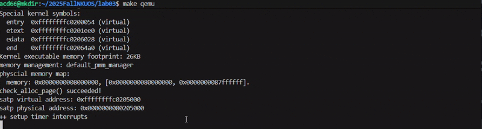
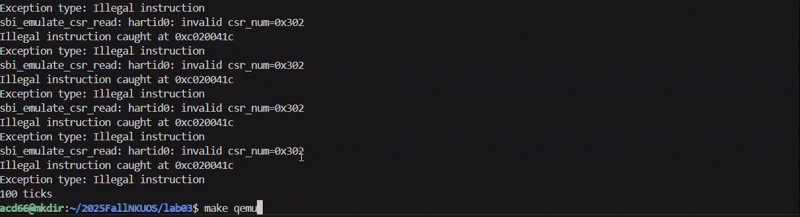

<h1>OS-lab03实验报告</h1>

## 练习1：完善中断处理(需要编程)
练习一要求我们完善中断处理函数trap,对时钟中断进行处理的部分填写时钟中断的处理部分，使操作系统每遇到100次时钟中断后，调用`print_ticks`子程序，向屏幕上打印一行文字"100 ticks"。在打印完10行后调用`sbi.h`中的`shut_down()`函数关机。

在实现之前，我们先对定时器中断(时钟中断)以及其中断处理流程进行简单的说明。时钟中断实际上就是每隔若干个时钟周期执行一次的程序。这个每隔若干个时钟周期的定时我们通过RISC-V提供的硬件支持实现:
    
1. OpenSBI提供了一个`sbi_set_timer()`接口，该接口可以传入一个时刻,让它在那个时刻触发一次时钟中断

2. `rdtime`伪指令,读取一个叫做`time`的CSR数值，表示CPU启动之后经过的真实时间。

我们要实现的是每隔一段时间就发生一次时钟中断，但是OpenSBI提供的接口一次只能设置一个时钟中断事件。因此我们采用的方式是最开始时设置一个时钟中断事件，之后每次触发时钟中断事件的时候，设置下一次的时钟中断。

在代码层面，我们是这样实现的，在进行`kern_init`的时候要进行`clock_init`,在这个时候我们设置第一个时钟中断事件，并记录时钟中断事件触发的次数`ticks`

之后每触发一次时钟中断事件，我们就给这个变量+1。每触发100次时钟中断事件，我们就调用子程序`print_ticks()`,打印出"100 ticks".另外为了实现一旦打印了10次"100 ticks"就调用`sbi_shut_down()`我们仿照`ticks`变量设置了`prints`变量，每次打印我们都给它+1，一旦它等于10就关机。

## Challenge1：描述与理解中断流程

## Challenge2：理解上下文切换机制

## Challenge3：完善异常中断(需要编程)

Challenge3要求我们完善异常中断，具体而言是两种异常的中断处理:"ILLEGAL INSTRUCTION"，即异常指令，如在非M态下使用指令`mret`."EBREAK",即断点。

对于处理而言就是输出异常类型以及异常触发的地址。

异常触发的地址由`trapframe`的epc寄存器记录，因此当异常触发的时候我们通过读取该寄存器里的值就可以获取被中断指令的虚拟地址。

而在异常处理后，我们需要更新epc，这里由于没有提供其他具体的处理函数，本来应该跳转到对应的处理函数的地址，这里直接跳转到下一条指令即可。

最后为了测试我们异常处理的正确性，我们在`clock.c`中用于获取的当前时间的`get_cycles`函数中插入了内联汇编代码`__asm__ __volatile__("mret");`从而触发这个异常，结果演示如下:

