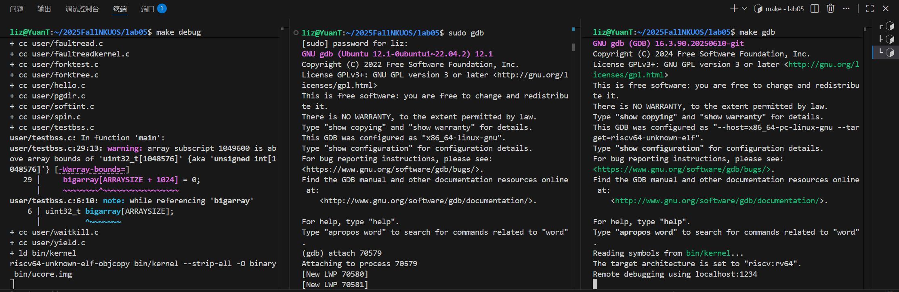
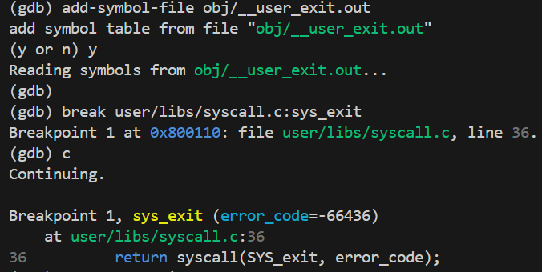
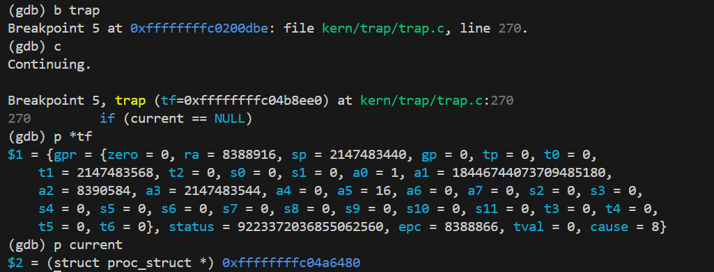
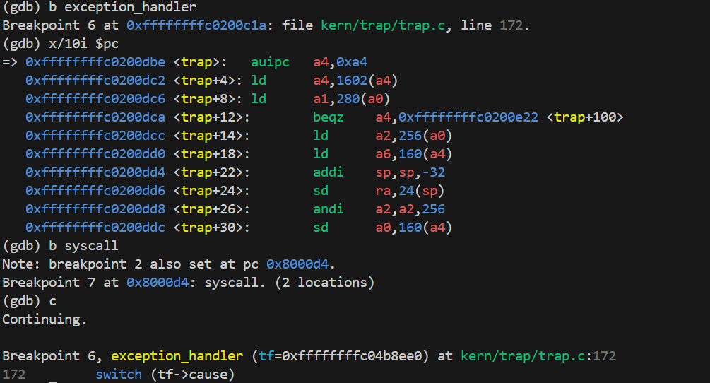
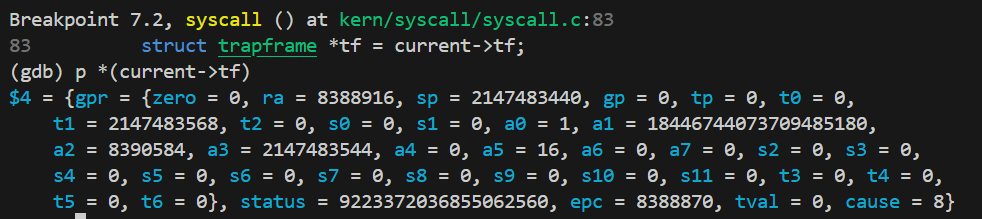
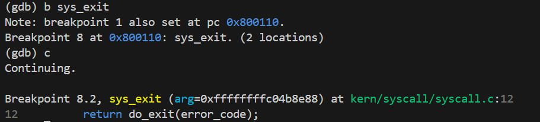
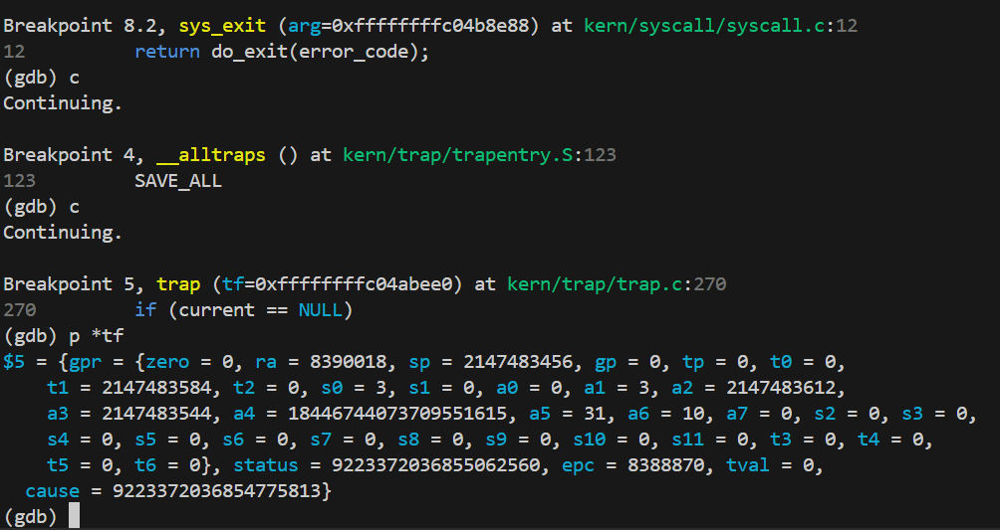

<center>
<h1>OS-lab05实验报告</h1>
</center>

## 基础练习:
### 练习一
下面从ucore启动到执行第一个应用程序的过程展开分析。

如lab04中操作一样，当我们启动ucore后，会自动创建`idle`内核进程和`init_main`内核进程.而`init_main`线程会在进程内创建`user_main`内核进程。而后者会使用宏`KERNEL_EXECVE`把内核镜像的用户程序作为参数，通过软中断触发`SYS_exec`系统调用，实现内核主动执行用户程序。

这里定义了多个宏:
```cpp
#define __KERNEL_EXECVE(name, binary, size) ({                          \
            cprintf("kernel_execve: pid = %d, name = \"%s\".\n",        \
                    current->pid, name);                                \
            kernel_execve(name, binary, (size_t)(size));                \
        })

#define KERNEL_EXECVE(x) ({                                             \
            extern unsigned char _binary_obj___user_##x##_out_start[],  \
                _binary_obj___user_##x##_out_size[];                    \
            __KERNEL_EXECVE(#x, _binary_obj___user_##x##_out_start,     \
                            _binary_obj___user_##x##_out_size);         \
        })

#define __KERNEL_EXECVE2(x, xstart, xsize) ({                           \
            extern unsigned char xstart[], xsize[];                     \
            __KERNEL_EXECVE(#x, xstart, (size_t)xsize);                 \
        })

#define KERNEL_EXECVE2(x, xstart, xsize)        __KERNEL_EXECVE2(x, xstart, xsize)
```

其中`_binary_obj___user_##x##_out_start`和`_binary_obj___user_##x##_out_size`都是编译的时候自动生成的符号。这里`##x##`是按照 C 语言宏的语法，会直接把 x 的变量名代替进去。

所以这里(`user_main`进程)在做的事情就是调用并执行函数:`kernel_execve("exit", _binary_obj___user_exit_out_start,_binary_obj___user_exit_out_size)`.这里实际上就是加载了存储在这个位置的程序`exit`并在`user_main`进程中开始执行。这时`user_main`就从内核进程变成了用户进程。

而通过翻阅`exit.c`我们发现在该程序中对`fork()`,`wait()`等函数进行了测试。这些函数都是对系统调用的封装。ucore通过如下方法实现系统调用(即在用户态的程序中获取内核态服务的方法)。

简单来说，函数调用就是在用户态提供了一个调用的接口，真正的处理都在内核态进行。

具体而言，我们首先在头文件中定义一些系统调用的编号，如`SYS_exit`是1等。然后系统调用实际上是在用户态通过内联汇编进行`ecall`环境调用.这将产生一个`trap`，进入到`S`态下进行异常处理。

然后在异常处理时会首先通过中断帧里scause寄存器的数值，判断出当前是来自USER_ECALL的异常,然后将sepc设置为`ecall`的下一条指令，最后调用`syscall`进行系统调用处理。

在`syscall`中`a0`寄存器存储了函数调用的编号，其他寄存器则存储了函数的参数。接着`syscall`就会把这些信息进行转发从而执行具体的函数。

回到整个流程。我们通过`kernel_execve`来启动第一个用户进程，进入用户态。首先来看`do_execve`的实现。

`load_icode`首先会创建一个新的mm和页目录，然后遍历ELF_program header,根据`p_flags`计算`vm_flags/perm`,调用`mm_map`建立VMA；之后利用`pgdir_alloc_page`为 TEXT/DATA/BSS 分页拷贝或清零；接下来用 mm_map + pgdir_alloc_page 搭建 4 页用户栈；之后把 current->mm/pgdir 切换到新地址空间；最后清零旧的`trapframe`设置sp=USTACKTOP、epc=elf->e_entry、status 的 SPP/SPIE 位，使 sret 回到用户态入口执行。

这里重点讲一下我们实现的第6步。这一步需要我们建立相应的用户内存空间来放置应用程序的代码段、数据段等，且要设置好proc_struct结构中的成员变量trapframe中的内容，确保在执行此进程后，能够从应用程序设定的起始执行地址开始执行。需设置正确的trapframe内容。

具体而言，我们首先留存旧的`sstatus`然后再将整个trapframe清空。之后将通用寄存器中的栈指针设置到用户栈顶。这样首次`sret`回到用户态时，用户代码一开始就有干净的栈空间是用。之后将`sepc`设置为ELF入口地址，保证启动的就是用户程序。对于`sstatus`则先清理掉当前特权级位`SPP`和全局中断使能位`SIE`保证回到用户态。然后`|= SSTATUS_SPIE`意思是在 sret 之后自动打开用户态的中断.经过上述配置，trapframe 保存了“下一次从内核返回时应该是什么样”的完整上下文：sret 会切换到 U 态、跳转到 elf->e_entry，并以 USTACKTOP 作为栈指针，具备正常的中断语义。这确保新用户进程在第一次调度时就能像正常 ELF 程序那样运行。

那么我们该如何实现`kernel_execve`函数呢？

我们不能直接调用`do_execve`，这是因为`do_execve`,`load_icode`中只是构建了用户程序运行的上下文，但是并没有完成切换。上下文切换实际上要借助中断处理的返回来完成。我们采用`ebreak`产生断点中断进行处理，通过设置`a7`寄存器的值为10说明这不是一个普通的断点中断，而是要转发到`syscall`,这样我们实现了在内核态复用系统调用的接口。

接下来我们梳理一下用户态进程被ucore选择占用CPU执行（RUNNING态）到具体执行应用程序第一条指令的整个经过。

首先调度器在`schedule()`选中该进程后，`proc_run`保存当前进程上下文、切换`current`指针，并用`switch_to`切换寄存器，使新的`current`获得CPU，状态标记位running。进入新进程时，内核仍然在`S`态运行；`load_icode` 先为该进程构建 `mm`、页表、用户栈以及 `ELF` 各段，然后把 trapframe 设置为：`sp=USTACKTOP`、`epc=elf->e_entry`、`status` 切到用户模式并允许返回后开中断。随后`proc_run`末尾或系统调用返回路径调用`sret`：硬件依据 trapframe 恢复寄存器、将 `satp` 指向的页表作为地址空间，并因 `SPP` 被清零而切换到 U 态。`sret`完成后，CPU的PC等于`tf->epc`，也就是应用程序的入口。栈指针指向用户栈顶，用户代码便开始执行第一条指令。
### 练习二
`copy_range`的功能实现了创建子进程函数`do_fork`在执行中拷贝当前进程（即父进程）的用户内存地址空间中的合法内容到新进程中（子进程），完成内存资源的复制的功能。

具体而言，我们是这样实现这个过程的。首先逐页遍历，通过`get_pte`找到父进程PTE，若为空则跳到下一个PTSIZE。若命中，则用`get_pte(to,start,1)`为子进程准备对应的PTE。之后取出父页表中的权限`perm=*ptep&PTE_USER`并解析出物理页`pte2page(*ptep)`。
接着会`alloc_page`分配新的页面然后用`memcpy`拷贝4KB，最后`page_insert`建立子进程映；失败路径记得回收新页，保障 fork 成功率。

我们同样实现了COW机制。如果采用COW机制，那么我们不再将父进程的内容copy到子进程中，而是两个进程共享同一物理页，并且把父子 PTE 的写权限都去掉，第一次写入时触发缺页异常再“真正复制”。

具体来说，我们是这样设计的。
在 `fork`地址空间复制时，不立即为子进程复制所有用户页，而是让父子进程先共享同一物理页。当任意一方第一次对共享页执行写操作时，触发缺页异常，再进行按需复制，从而减少内存占用和复制开销。

具体实现过程中，在进程创建阶段的地址空间复制函数中（如 copy_range），当启用 COW 机制时，系统不再为子进程分配新的物理页并拷贝数据，而是将子进程对应虚拟地址的页表项直接映射到父进程相同的物理页。同时，为了保证写时能够触发异常，父进程和子进程对应页表项中的写权限位（PTE_W）都会被清除，使得该页在逻辑上变为只读。由于父进程的页表项被修改，还需要对相应虚拟地址执行 TLB 失效操作，以避免处理器继续使用旧的可写映射。

在缺页异常处理阶段，当进程对共享页执行写操作时，由于页表项中写权限被清除，处理器会触发写相关的 page fault。异常处理程序首先定位发生异常的虚拟地址及其页表项，并判断该异常是否属于 Copy-on-Write 情况。常见的判断方式是检查页表项有效且为用户页、当前不具有写权限，并结合物理页的引用计数或软件标记位来确认该页是否为共享页。

一旦确认发生了写时复制，系统根据物理页的共享情况采取不同策略。如果该物理页的引用计数大于 1，说明仍被多个进程共享，此时内核会为当前进程分配一个新的物理页，将原页内容完整复制到新页中，并更新当前进程页表项，使其指向新分配的物理页，同时恢复写权限。若物理页的引用计数等于 1，则说明该页已不再被其他进程共享，无需进行数据复制，只需直接恢复页表项中的写权限即可。无论哪种情况，页表项更新完成后都需要对对应虚拟地址执行 TLB 失效，以保证新的映射和权限生效。

通过上述设计，系统在保证进程地址空间隔离和语义正确性的前提下，实现了按需复制的内存管理策略。该机制显著降低了进程创建时的内存拷贝成本，并且只有在实际发生写操作时才分配和复制物理页，达到了性能与内存效率之间的良好平衡。

### 练习三
我们在练习一的报告中已经对这些函数的执行流程进行了分析，这里不再过多赘述。
- fork：用户态调用 sys_fork（通常通过 ecall），内核陷入后在 do_fork 内复制 mm、建立页表、复制/设置 trapframe，并将子进程加入 RUNNABLE。完成后内核在父/子各自的 trapframe 里写好 a0（父得子 pid，子得 0），再 sret 回用户态，所以同一个系统调用在两个上下文返回不同值。

- exec：用户态调用 sys_exec，内核态 do_execve 先销毁旧地址空间，再 load_icode 创建新的 mm、映射 ELF 各段、建立用户栈和 trapframe（pc 指向新程序入口）。回到用户态时已经在新指令流里继续执行，原用户栈/代码完全替换。

- wait：父进程在用户态调用 sys_wait 后陷入内核，do_wait 遍历子进程表；若存在 ZOMBIE，就收集 exit_code、释放其资源、返回结果；若没有，需要把父进程挂到等待队列并 schedule，直到某子进程 exit 唤醒。返回值同样写入父进程 trapframe，之后 sret 回到用户态继续执行。

- exit：用户态 sys_exit 进入内核，do_exit 负责关闭文件、释放 mm、把自身状态设为 ZOMBIE 并唤醒父进程。在 do_exit 末尾不会返回用户态，而是调用调度让下一个进程运行；父进程在 wait 返回时才能得到退出码。

用户态与内核态的交错：每次系统调用或异常（ecall/缺页/中断）触发内核态执行，内核通过 trapframe 保存/恢复用户寄存器和 sstatus；完成后通过 sret 回到用户态。换句话说，用户态只负责发起调用或执行异常指令，真正的进程创建、地址空间管理等都在内核态完成，内核的执行结果通过修改 trapframe（如 a0 返回值、pc、sp 等）“带回”用户态。

```
       +------+
       | NEW  |<----------------+
       +------+                 |
           | proc_init/do_fork  |
           v                    |
       +---------+  schedule    |
       | RUNNABLE|<------------+
       +---------+              |
           | schedule->proc_run |
           v                    | time slice / wakeup
       +---------+              |
       | RUNNING |--------------+
       +---------+ \
        |    |      \
        |    | sleep  \
        |    v         v
  do_wait   +---------+ wakeup_proc
            |SLEEPING |
            +---------+
        |
        v do_exit/do_kill
       +--------+
       | ZOMBIE |
       +--------+
            |
            | parent do_wait
            v
        +-------+
        | FREE  |
        +-------+
```
## 扩展练习
### 扩展一

见练习二。我们详细讲一下我们的测试:

测试脚本位于tools/cowtest.sh.

整体流程为:

- 先 make clean 清旧构建
- 再 make build-cowtest 把内核编译成带 TEST=cowtest 的镜像。
- 第三步用 qemu-system-riscv64（可被 QEMU 环境变量覆盖）启动镜像，-device loader,file=bin/ucore.img,addr=0x80200000 把 ucore 放到 0x8020_0000；运行被 timeout 20s 包裹，保证挂死时自动退出。所有 QEMU 输出重定向到 obj/cowtest.log

我们的测试程序位于/user/cowtest

这段程序在 fork() 前先把全局缓冲 pagebuf（位于 .data 段，对应同一个物理页）写成 "parent"，确保父进程的这页数据已经存在。

fork() 之后父子进程本应各自持有同样的数据；若实现了 COW，页表里会把这页标记为只读并共享同一物理页，引用计数 >1。

子进程分支内执行 strcpy(pagebuf, "child")，这是对共享页的写操作：若 COW 正确实现，缺页异常会触发“复制”逻辑，子进程获得独立的新物理页并写入 "child"；父进程仍指向旧页，因此 pagebuf 应维持为 "parent"。

子进程输出 child wrote: child 后退出，父进程 wait() 等待子进程结束，然后打印 parent still sees: parent 并检查 pagebuf 是否保持 "parent"。若父进程看到 "child"，说明写时复制失败，两个进程实际上仍共享同一页。

最后只有当比较成功（父=parent、子=child）时才会打印 COW test pass.。因此这个测试同时验证了“写到共享页会复制”以及“父子进程互不影响”两个关键条件，是最基本的 COW 正确性检查。

### 扩展二
lab05 的 user 程序在内核启动阶段由 `load_icode` 预加载：`kernel_main` 调用 `proc_init` -> `proc_create` -> `load_icode`，直接把 ELF 的文本/数据段复制到新进程的物理页里，并在创建进程时提前铺好用户栈。这意味着进程还没被调度运行，就已经具备完整的内存镜像。

常见桌面 OS（Linux/Windows）通常在 execve 时“按需加载”：只建立 VMA/页表，真正的代码数据由分页异常触发、在访问时 lazy load，并且文件内容来自磁盘文件系统。

之所以不同，是因为 ucore 环境没有完整的文件系统和页缓存；用户程序以二进制数组链接进内核镜像（或直接放在内存中），因此只能在内核里一次性拷贝到内存。

## 分支练习
## lab5分支练习
由于本次分支实验同样使用双重GDB调试策略，我们同样要建立三个终端，分别为：

- 终端1：使用make debug指令

- 终端2：附加调试QEMU进程，启动GDB附加到QEMU进程上

  首先使用指令`pgrep -f qemu-system-riscv64 `获取QEMU进程的PID，随后启动GDB，在会话中使用`attach <pid>`将其附加在QEMU进程上，由于我们希望会话收到信号后，不暂停程序执行且不打印信号接收信息，所以我们使用这个指令来完成这个操作：`handle SIGPIPE nostop noprint`。随后按c启动执行

- 终端3：这个终端用于调试操作系统内核和运行的用户程序



由于当前makefile下的make gdb指令只包含kernel下的调试信息，而我们现在想要观测的是user下的syscall函数，于是我们挑选了一个用户程序exit.c进行调试，该用户程序中使用了exit(magic)这个系统调用，其中magic为-66436。

我们先来分析一下用户程序执行exit函数后的具体逻辑：首先，exit函数属于用户ulib库中的函数，属于sys_exit函数的封装，而sys_exit函数实际上则是用户syscall函数的封装，所以说当我们执行exit(magic)时，实际上进行了一次系统调用：`syscall(SYS_exit, magic)`。为了让本来只可以读取kernel调试信息的gdb可以看到user的调试信息，我们先将包含exit.c的符号表和调试信息的ELF文件__user_exit.out载入gdb符号表，然后就可以在user下的sys_exit函数处设置断点了。

如下图所示：程序停在sys_exit函数处，此时参数error_code为-66436，即exit.c文件中的magic：



随后我们进行如下调试：现在用户syscall函数处设置断点，让程序继续运行，然后查看此时的汇编代码。此时可以看到syscall函数的第一个参数(也就是syscall编码为1，恰好为sys_exit的系统调用编码)。然后在syscall函数内联汇编代码部分之前设置断点，可以看到第二段汇编代码正好是用户syscall函数的内联汇编代码，我们着重观测的就是ecall的调用。

```bash
(gdb) break user/libs/syscall.c:syscall
Breakpoint 2 at 0x8000d4: file user/libs/syscall.c, line 15.
(gdb) c
Continuing.

Breakpoint 2, syscall (num=num@entry=1)
    at user/libs/syscall.c:15
15              a[i] = va_arg(ap, uint64_t);
(gdb) x/10i $pc
=> 0x8000d4 <syscall>:  addi    sp,sp,-144
   0x8000d6 <syscall+2>:        addi    t1,sp,128
   0x8000da <syscall+6>:        sd      a0,8(sp)
   0x8000dc <syscall+8>:        sd      a1,88(sp)
   0x8000de <syscall+10>:       sd      a1,40(sp)
   0x8000e0 <syscall+12>:       sd      a2,96(sp)
   0x8000e2 <syscall+14>:       sd      a2,48(sp)
   0x8000e4 <syscall+16>:       sd      a3,104(sp)
   0x8000e6 <syscall+18>:       sd      a3,56(sp)
   0x8000e8 <syscall+20>:       sd      a4,112(sp)
(gdb) break user/libs/syscall.c:18
Breakpoint 3 at 0x8000f0: file user/libs/syscall.c, line 19.
(gdb) c
Continuing.

Breakpoint 3, syscall (num=num@entry=1)
    at user/libs/syscall.c:19
19          asm volatile (
(gdb) x/10i $pc
=> 0x8000f0 <syscall+28>:       sd      a6,128(sp)
   0x8000f2 <syscall+30>:       sd      a7,136(sp)
   0x8000f4 <syscall+32>:       sd      t1,32(sp)
   0x8000f6 <syscall+34>:       ld      a0,8(sp)
   0x8000f8 <syscall+36>:       ld      a1,40(sp)
   0x8000fa <syscall+38>:       ld      a2,48(sp)
   0x8000fc <syscall+40>:       ld      a3,56(sp)
   0x8000fe <syscall+42>:       ld      a4,64(sp)
   0x800100 <syscall+44>:       ld      a5,72(sp)
   0x800102 <syscall+46>:       ecall
```

当执行ecall指令时，QEMU会向其模拟的CPU输送trap信息，然后从stvec中获取异常处理的入口，也就是__alltraps，其会构造一个trap_frame结构体，会记录用户syscall传入的参数信息和系统调用编号，以及该进程的部分寄存器数据和CSR寄存器数据，为了观察这个trapframe，我们先在\_\_alltraps处设置断点，终端有如下输出：


随后在trap函数中设置断点，观察trapframe结构：可以看到cause为8，说明此时发生的是用户态的系统调用；a0为1，说明该系统调用为sys_exit型系统调用。



由于trap函数的代码如下，而此时current不为空，所以会进入else语句块中，执行函数trap_dispatch，由于此时的cause>0，于是会进入exception_handler。

```c
void trap(struct trapframe *tf){
    if (current == NULL)
    {
        trap_dispatch(tf);
    }
    else
    {
        struct trapframe *otf = current->tf;
        current->tf = tf;

        bool in_kernel = trap_in_kernel(tf);

        trap_dispatch(tf);

        current->tf = otf;
        if (!in_kernel)
        {
            if (current->flags & PF_EXITING)
            {
                do_exit(-E_KILLED);
            }
            if (current->need_resched)
            {
                schedule();
            }
        }
    }
}
```

而由于此时的cause为8，会进入这一条case中，此时的syscall函数为内核下的syscall函数

```c
    case CAUSE_USER_ECALL:
        // cprintf("Environment call from U-mode\n");
        tf->epc += 4;
        syscall();
        break;
```

于是我们进行如下设置，一路执行到内核syscall函数的开头：



由于内核syscall函数的代码如下：

```c
void
syscall(void) {
    struct trapframe *tf = current->tf;
    uint64_t arg[5];
    int num = tf->gpr.a0;
    if (num >= 0 && num < NUM_SYSCALLS) {
        if (syscalls[num] != NULL) {
            arg[0] = tf->gpr.a1;
            arg[1] = tf->gpr.a2;
            arg[2] = tf->gpr.a3;
            arg[3] = tf->gpr.a4;
            arg[4] = tf->gpr.a5;
            tf->gpr.a0 = syscalls[num](arg);
            return ;
        }
    }
    print_trapframe(tf);
    panic("undefined syscall %d, pid = %d, name = %s.\n",
            num, current->pid, current->name);
}
```

此时`current->tf`在trap函数体内就被设置为了发生系统调用的trapframe，当然我们可以再在GDB中检查一下，此时`tf->gpr.a0`等于1，说明发生属于sys_exit(内核)系统调用，会进入到sys_exit函数继续执行。另外，由于在exception_handler中进行了epc的加四处理(跳过发生syscall的指令)，相比于之前的tf.epc增加四，从8388866 >> 8388870：



随后在sys_exit(内核)处设置断点，进入sys_exit函数，其为do_exit函数的封装。



于是我们进入到最后一步，观察do_fork函数。由于sys_exit的系统调用会退出进程(将进程的状态变为僵尸状态)，然后主动调用调度器进行进程切换以让出CPU，所以并不存在使用sret返回用户态：

```c
int do_exit(int error_code)
{
    if (current == idleproc)
    {
        panic("idleproc exit.\n");
    }
    if (current == initproc)
    {
        panic("initproc exit.\n");
    }
    //随后回收用户进程的地址空间
    struct mm_struct *mm = current->mm;
    if (mm != NULL)
    {
        lsatp(boot_pgdir_pa);
        if (mm_count_dec(mm) == 0)
        {
            exit_mmap(mm);
            put_pgdir(mm);
            mm_destroy(mm);
        }
        current->mm = NULL;
    }
    //回收完相关资源后，将当前进程(也就是正在系统调用的这个进程)的状态设置为僵尸态
    //并且将exit_code设置为内核sys_exit函数传入的参数error_code
    current->state = PROC_ZOMBIE;
    current->exit_code = error_code;
    bool intr_flag;
    struct proc_struct *proc;
    local_intr_save(intr_flag);
    {
        //唤醒父进程，通知其有子进程退出需要回收
        proc = current->parent;
        if (proc->wait_state == WT_CHILD)
        {
            wakeup_proc(proc);
        }
        //此时由于当前进程会退出(因为当前进程即为执行sys_exit系统调用的进程)，
        //所以需要将当前进程的所有子进程都重新分配给init进程
        while (current->cptr != NULL)
        {
            proc = current->cptr;
            current->cptr = proc->optr;

            proc->yptr = NULL;
            if ((proc->optr = initproc->cptr) != NULL)
            {
                initproc->cptr->yptr = proc;
            }
            proc->parent = initproc;
            initproc->cptr = proc;
            if (proc->state == PROC_ZOMBIE)
            {
                if (initproc->wait_state == WT_CHILD)
                {
                    wakeup_proc(initproc);
                }
            }
        }
    }
    local_intr_restore(intr_flag);
    //当前进程已经时僵尸进程了，主动调用调度器让出CPU
    schedule();
    panic("do_exit will not return!! %d.\n", current->pid);
}
```


由于发生exit类型的系统调用并不会sret，所以当我们再次运行的时候，会进入下一轮的Trap处理：此时的trapframe中数据已经修改，a0变为0

