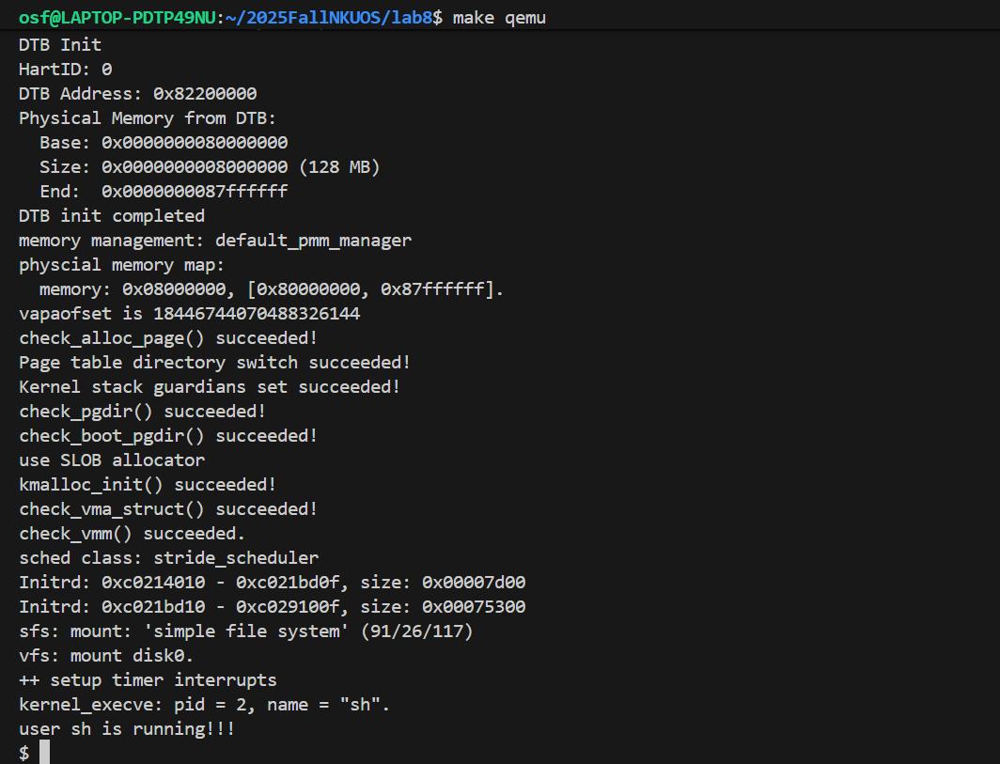
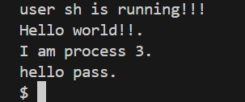
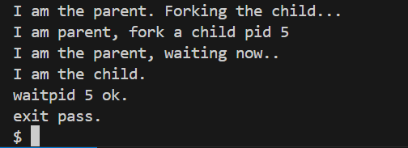
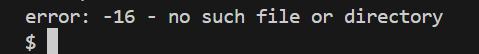
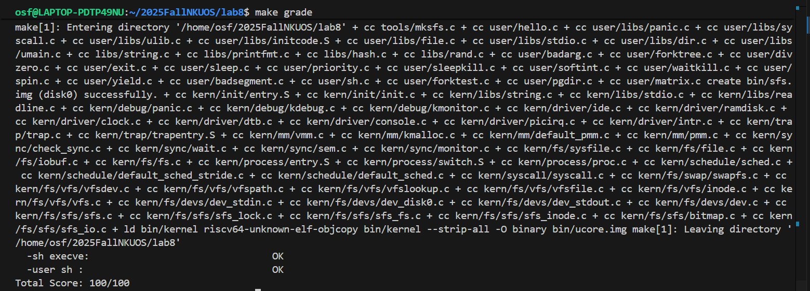

## 练习2: 完成基于文件系统的执行程序机制的实现（需要编码）

### 1. 实验目标（练习2）

​       这一部分我们要在 `ucore/ucore-rv` 的内核中实现**基于文件系统的执行程序机制**：使得用户态终端能够根据输入的程序名，从 `SimpleFS`（`sfs`）中读取 `ELF` 可执行文件，将其装载到进程的用户虚拟地址空间，并正确设置用户栈与参数，从而成功执行用户程序（如 `hello`、`exit` 等）。

完成这一部分后，我们通过`shell`执行外部程序时应当遵循以下流程：

1. `shell` 调用 `fork()` 创建子进程，进入内核 `do_fork` 完成子进程结构建立；
2. 子进程调用 `execve(path, argc, argv)`，进入内核 `do_execve`；
3. `do_execve` 通过 `sysfile_open(argv[0], O_RDONLY)` 打开可执行文件获得文件描述符 `fd`，并释放旧地址空间；
4. 调用 `load_icode(fd, argc, kargv)`：从文件系统读取 `ELF`，建立新的 `mm/pgdir`，映射并装载各段，构造用户栈并写入参数；
5. 设置 `trapframe`（`epc=ELF entry`，`sp=stacktop`，`a0/a1=argc/argv`），内核返回用户态后从新程序入口开始执行。

### 2. 代码实现

#### 2.1 do_fork 支持 exec 前置条件（文件表继承）

​       在这次实验中，我们要保证`fork`出来的子进程必须继承父进程的 `filesp`/文件描述符表，否则 `exec` 阶段无法通过 `sysfile_` 访问可执行文件，`shell` 的 `I/O` 也可能异常。

​       因此在 `do_fork` 中，除完成实验`4`的基本进程创建流程（`alloc_proc`、`setup_kstack`、`copy_mm`、`copy_thread`）以及实验`5`的父子关系维护（`proc->parent=current`、`set_links`）外，还要需要额外保证子进程拥有正确的文件系统上下文，所以我们就在 `copy_mm` 之后增加 `copy_files(clone_flags, proc)`，使子进程继承父进程的文件描述符表 `filesp`。

```c
if (copy_files(clone_flags, proc) != 0)
    { // for LAB8
        goto bad_fork_cleanup_mm;
    }
bad_fork_cleanup_mm:
    if (proc->mm != NULL && mm_count_dec(proc->mm) == 0) {
        exit_mmap(proc->mm);
        put_pgdir(proc->mm);
        mm_destroy(proc->mm);
    }
```

该步骤保证子进程在随后执行 `do_execve/load_icode` 时，能够通过 `sysfile_open/seek/read` 正常访问 `sfs` 中的 `ELF` 文件并完成装载，同时也维持了 `shell` 的标准输入输出等文件状态的一致性。

#### 2.2 do_execve：从文件系统打开 ELF 并替换旧地址空间

- **参数安全拷贝（避免用户指针失效）**

  因为`do_execve` 接收的 `name` 和 `argv` 均为用户态指针，为了避免 `exec` 过程中释放旧 `mm` 后用户指针失效，所以我们要先在加锁条件下使用 `copy_string` 将进程名复制到内核缓冲区 `local_name`，并通过 `copy_kargv` 将参数字符串复制到内核，形成内核可用的 `kargv[]`，完成之后再释放 `mm` 锁进入后续流程。

  ```c
  struct mm_struct *mm = current->mm;
  lock_mm(mm);
  if (name == NULL) {
      snprintf(local_name, sizeof(local_name), "<null> %d", current->pid);
  } else {
      if (!copy_string(mm, local_name, name, sizeof(local_name))) {
          unlock_mm(mm);
          return -E_INVAL;
      }
  }
  if ((ret = copy_kargv(mm, argc, kargv, argv)) != 0) {
      unlock_mm(mm);
      return ret;
  }
  path = argv[0];    // 这里用用户态指针
  unlock_mm(mm);
  ```

- **路径选择**

  另外我们的路径选择中 `path = argv[0]` 使用的是**用户态指针**，这是因为 `sysfile_open` 对其第一个参数会进行用户指针合法性检查，并在内核中执行从用户空间拷贝路径的过程，具体的调用顺序为：`copy_kargv -> path=argv[0] -> unlock_mm -> files_closeall -> sysfile_open(path, ...)`，其中 `sysfile_open` 发生在旧 `mm` 释放之前，因此 `argv[0]` 仍指向有效的用户地址空间，不会出现悬空指针，但是如果改用 `kargv[0]`（内核地址）反而会绕过/触发用户指针检查失败，导致 `open` 无法成功。

  ```c
  files_closeall(current->filesp);
  int fd;
  if ((ret = fd = sysfile_open(path, O_RDONLY)) < 0) {
      goto execve_exit;
  }
  ```

- **打开 ELF 文件 + 释放旧 mm 的正确顺序**

  在`do_execve`中，我们首先调用 `sysfile_open(path, O_RDONLY)` 在 `sfs` 中打开可执行文件获得 `fd`，之后若进程原本存在旧的 `mm`，则先切换到内核页表 `boot_pgdir`（`lsatp(boot_pgdir_pa)`）并刷新 `TLB`，随后在引用计数归零时依次执行 `exit_mmap/put_pgdir/mm_destroy` 释放旧地址空间，并将 `current->mm` 置空，这样可以避免在仍使用旧用户页表时释放映射导致访问异常。

  ```c
  if (mm != NULL) {
      lsatp(boot_pgdir_pa);
      flush_tlb();
  
      if (mm_count_dec(mm) == 0) {
          exit_mmap(mm);
          put_pgdir(mm);
          mm_destroy(mm);
      }
      current->mm = NULL;
  }
  ```

- **调用 load_icode 完成装载**

  完成文件打开与旧地址空间清理后，`do_execve` 将调用 `load_icode(fd, argc, kargv)` 装载新程序，成功后关闭 `fd`，释放 `kargv`，并用 `set_proc_name` 更新进程名；

  ```c
  ret = -E_NO_MEM;
  if ((ret = load_icode(fd, argc, kargv)) != 0) {
      sysfile_close(fd);
      goto execve_exit;
  }
  sysfile_close(fd);
  
  put_kargv(argc, kargv);
  set_proc_name(current, local_name);
  return 0;
  ```

  若装载失败则调用 `do_exit(ret)` 退出当前进程。

  ```c
  execve_exit:
      put_kargv(argc, kargv);
      do_exit(ret);
      panic("already exit: %e.\n", ret);
  ```

#### 2.3 load_icode：通过 fd 读取 ELF，建立新用户态环境（核心）

- **创建 mm 与 pgdir**

  首先我们进行`load_icode` 的前置条件是 `current->mm == NULL`，函数会首先调用 `mm_create()` 创建新的 `mm_struct`，随后调用 `setup_pgdir(mm)` 建立新的页表 `pgdir`，使该页表包含内核映射，同时用户态部分为空，为后续段映射准备。

  ```c
  if (current->mm != NULL) {
      panic("load_icode: current->mm must be empty.\n");
  }
  
  struct mm_struct *mm;
  if ((mm = mm_create()) == NULL) {
      goto bad_mm;
  }
  
  if (setup_pgdir(mm) != 0) {
      goto bad_pgdir_cleanup_mm;
  }
  ```

- **读取 ELF Header 与 Program Header（来自文件系统）**

  这里和实验`5`从内存指针读取 `ELF` 不同，而是通过文件描述符 `fd` 从 `sfs` 读取 `ELF` 内容：先使用 `load_icode_read(fd, &elf, sizeof(elf), 0)` 读取 `ELF header`，并根据 `elf.e_phoff/elf.e_phnum` 分配 `phdrs` 并读取 `program header` 表，最后还要检查 `elf.e_magic` 确认 `ELF` 的合法性。

  ```c
  struct elfhdr elf;
  if ((ret = load_icode_read(fd, &elf, sizeof(elf), 0)) != 0) {
      goto bad_elf_cleanup_pgdir;
  }
  
  if ((phdrs = kmalloc(sizeof(struct proghdr) * elf.e_phnum)) == NULL) {
      ret = -E_NO_MEM;
      goto bad_elf_cleanup_pgdir;
  }
  
  if ((ret = load_icode_read(fd, phdrs,
          sizeof(struct proghdr) * elf.e_phnum, elf.e_phoff)) != 0) {
      goto bad_free_phdrs;
  }
  
  if (elf.e_magic != ELF_MAGIC) {
      ret = -E_INVAL_ELF;
      goto bad_free_phdrs;
  }
  ```

- **映射并装载 PT_LOAD 段：TEXT/DATA 拷贝 + BSS 补零**

  然后开始遍历所有的 `program header`，对 `p_type==PT_LOAD` 的段执行装载，首先根据 `p_flags` 计算 `VMA` 权限（`VM_READ/VM_WRITE/VM_EXEC`）并转换为 `RISC-V` 的页表权限位（`PTE_R/W/X`），调用 `mm_map(mm, p_va, p_memsz, vm_flags, NULL)` 建立覆盖整个 `p_memsz` 的 `VMA`。

  ```c
  vm_flags = 0, perm = PTE_U | PTE_V;
  if (ph->p_flags & ELF_PF_X) vm_flags |= VM_EXEC;
  if (ph->p_flags & ELF_PF_W) vm_flags |= VM_WRITE;
  if (ph->p_flags & ELF_PF_R) vm_flags |= VM_READ;
  
  if (vm_flags & VM_READ)  perm |= PTE_R;
  if (vm_flags & VM_WRITE) perm |= (PTE_W | PTE_R);
  if (vm_flags & VM_EXEC)  perm |= PTE_X;
  if ((ret = mm_map(mm, ph->p_va, ph->p_memsz, vm_flags, NULL)) != 0) {
      goto bad_cleanup_mmap;
  }
  ```

  对于文件中实际存在的部分 `[p_va, p_va+p_filesz)`，按页调用 `pgdir_alloc_page(mm->pgdir, la, perm)` 分配并映射物理页，再使用 `load_icode_read(fd, page2kva(page)+off, size, bin_offset)` 从文件偏移读取段内容写入页中，从而实现 `TEXT/DATA` 的装载。

  ```c
  uintptr_t start = ph->p_va;
  uintptr_t la = ROUNDDOWN(start, PGSIZE);
  uintptr_t end = ph->p_va + ph->p_filesz;
  off_t bin_offset = ph->p_offset;
  
  while (start < end) {
      if ((page = pgdir_alloc_page(mm->pgdir, la, perm)) == NULL) {
          goto bad_cleanup_mmap;
      }
      size_t off = start - la;
      size_t size = PGSIZE - off;
      if (end < la + PGSIZE) size = end - start;
  
      if ((ret = load_icode_read(fd, page2kva(page) + off, size, bin_offset)) != 0) {
          goto bad_cleanup_mmap;
      }
      start += size;
      bin_offset += size;
      la += PGSIZE;
  }
  ```

  对于内存中需要但文件中不存在的部分（`BSS`，即 `p_memsz > p_filesz`），对剩余区域按页补零：若与最后一页重叠则对页内剩余部分 `memset` 清零，否则分配新页后清零，保证 `BSS` 段初值为 `0`。

  ```c
  end = ph->p_va + ph->p_memsz;
  
  if (start < la) {
      if (start == end) continue;
  
      size_t off = start + PGSIZE - la;
      size_t size = PGSIZE - off;
      if (end < la) size -= la - end;
  
      memset(page2kva(page) + off, 0, size);
      start += size;
  }
  
  while (start < end) {
      if ((page = pgdir_alloc_page(mm->pgdir, la, perm)) == NULL) {
          goto bad_cleanup_mmap;
      }
      size_t off = start - la;
      size_t size = PGSIZE - off;
      la += PGSIZE;
      if (end < la) size -= la - end;
  
      memset(page2kva(page) + off, 0, size);
      start += size;
  }
  ```

- **建立用户栈并压入参数**

  装载完各段后，调用 `mm_map(mm, USTACKTOP-USTACKSIZE, USTACKSIZE, VM_READ|VM_WRITE|VM_STACK, NULL)` 建立栈区 `VMA`，并预分配若干栈页以保证可写；随后从高地址向低地址依次将每个参数字符串复制到用户栈中，并记录其用户虚拟地址；最后再将 `argv[]` 指针数组本体拷贝到用户栈，形成用户态可直接使用的 `argc/argv` 布局。

  ```c
  vm_flags = VM_READ | VM_WRITE | VM_STACK;
  if ((ret = mm_map(mm, USTACKTOP - USTACKSIZE, USTACKSIZE, vm_flags, NULL)) != 0) {
      goto bad_cleanup_mmap;
  }
  
  assert(pgdir_alloc_page(mm->pgdir, USTACKTOP - PGSIZE, PTE_USER) != NULL);
  assert(pgdir_alloc_page(mm->pgdir, USTACKTOP - 2*PGSIZE, PTE_USER) != NULL);
  assert(pgdir_alloc_page(mm->pgdir, USTACKTOP - 3*PGSIZE, PTE_USER) != NULL);
  assert(pgdir_alloc_page(mm->pgdir, USTACKTOP - 4*PGSIZE, PTE_USER) != NULL);
  
  assert(*get_pte(mm->pgdir, USTACKTOP - PGSIZE, 0) & PTE_W);
  ```

- **切换到新页表 + 设置 trapframe，返回用户态执行**

  栈与段映射完成后，将 `mm` 挂到 `current->mm`，并通过 `lsatp(PADDR(mm->pgdir))` 切换页表并刷新 `TLB`，最后设置 `trapframe`：

  ```c
  mm_count_inc(mm);
  current->mm = mm;
  current->pgdir = PADDR(mm->pgdir);
  
  lsatp(PADDR(mm->pgdir));
  flush_tlb();
  
  struct trapframe *tf = current->tf;
  uintptr_t sstatus = tf->status;
  memset(tf, 0, sizeof(struct trapframe));
  
  uintptr_t argv_user = stacktop;
  stacktop = ROUNDDOWN(stacktop, 16);
  
  tf->gpr.sp = stacktop;
  tf->gpr.a0 = argc;
  tf->gpr.a1 = argv_user;
  tf->epc = elf.e_entry;
  
  tf->status = sstatus & ~(SSTATUS_SPP | SSTATUS_SIE);
  tf->status |= SSTATUS_SPIE;
  tf->status |= SSTATUS_SUM;
  ```

- **异常清理**

  若在装载过程中任一步失败，按资源创建的逆序释放：包括 `exit_mmap/put_pgdir/mm_destroy` 以及 `phdrs/uargv` 的释放；若已经将页表切换到新 `pgdir`，则先切回 `boot_pgdir` 再释放用户映射，避免在无效页表上继续执行。

### 3. 结果验证

首先我们执行`make qemu`，结果如下，可以看到成功进入`shell`：


然后我们可以在终端输入几个程序进行测试：

- **执行 hello**

  我们先输入`hello`测试是否可以输出预期字符串，结果如下，说明 `sysfile_open + load_icode_read` 能从 `sfs` 读取 `ELF` 并成功执行：

  

- **执行 exit**

  接着输入`exit`，结果如下，可以看到子进程退出，`shell` 返回提示符，说明 `fork/exec/wait` 协同工作正常：

  

- **执行不存在的程序**

  另外我们还可以测试当输入`user`目录下不存在的程序名时，结果如何：

  

  可以看到`exec` 打开失败后输出错误提示：`no such file`，子进程退出，`shel`l 仍可继续接受命令，说明错误路径处理正确且不会破坏父进程。

以上测试结果说明我们已经成功实现了一个可以通过文件系统和用户程序交互的终端，最后我们测试`make grade`结果如下，得分为`100/100`，本次实验圆满结束！

